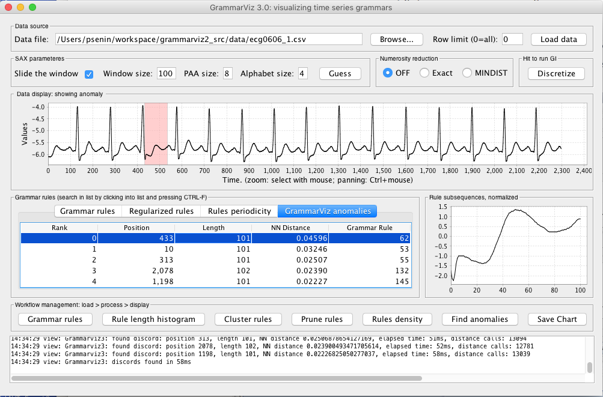
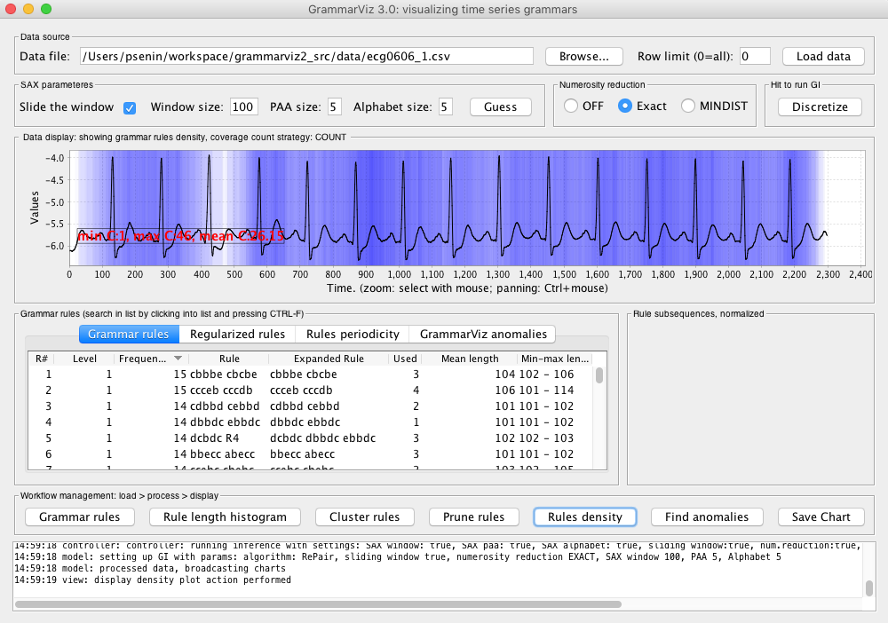

## Anomaly discovery with GrammarViz 3.0

### 1. Introduction
In this module we discuss the anomaly detection in QTDB 0606 ECG dataset. This data set (database record) can be downloaded from [PHYSIONET FTP](http://physionet.org/physiobank/database/qtdb/) and converted into the text format by executing this command
<pre>
rdsamp -r sele0606 -f 120.000 -l 60.000 -p -c | sed -n '701,3000p' >0606.csv
</pre>
in the linux shell (assuming that you have rdsamp installed at your system).
We use the second column of this file. This is our dataset overview:

  

    

      
    

  

We know, that the third heartbeat of this dataset contains the true anomaly as it was discussed in [HOTSAX paper by Eamonn Keogh, Jessica Lin, and Ada Fu](http://www.cs.gmu.edu/~jessica/publications/discord_icdm05.pdf). Note, that the authors were specifically interested in finding anomalies which are shorter than a regular heartbeat following a suggestion given by the domain expert: "_... We conferred with cardiologist, Dr. Helga Van Herle M.D., who informed us that heart irregularities can sometimes manifest themselves at scales significantly shorter than a single heartbeat...._"
Figure 13 of the paper further explains the nature of this true anomaly:

  

    

      
    

  

## 2. Variable length *exact* anomaly discovery using GrammarViz 2.0
Load the dataset using the "Load data" button, adjust SAX discretization parameters to sliding window 100, PAA 3, and alphabet 3. Click "Discretize" to infer a grammar describing the input time series. Click "Find anomalies" button to perform the anomaly discovery, then select the GrammarViz anomalies tab and choose the top ranked anomaly (#0):

  

    

      
    

  

this highlights the grammar rule which coincides with the true anomaly. *Note that rule #8 is of length 110 while the next anomaly, the rule #25 is of length 208*

## 3. Variable length *approximate* anomaly discovery using rule density curve
We use the same dataset. First, change the GI algorithm from Sequitur to RePair using GUI's menu: click on "Settings" -> chose "GI Implementation tab" -> and toggle "Re-Pair" algorithm to be used:

  

    

      
    

  

Click "Save" button to update the parameters. Adjust SAX discretization parameters to sliding window 100, PAA 5, and alphabet 5. Click "Discretize" to infer a Re-Pair grammar describing the input time series. Then click on "Rules density" button:

  

    

      
    

  

The light blue/white color near position 480 clearly identifies the true anomaly.

## 4. Discussion
Note, that due to two factors: the numerosity reduction embedded in the data discretization process and the nature of GI algorithms, that create rules based on the long-range correlations, both anomaly discovery techniques shown above yield sets of rare subsequences of a *variable length*.
