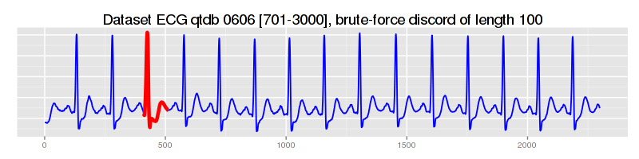
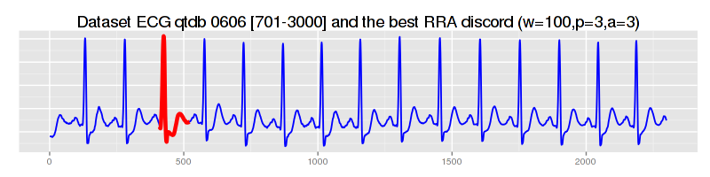
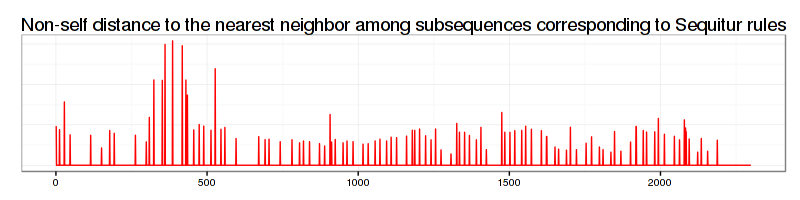
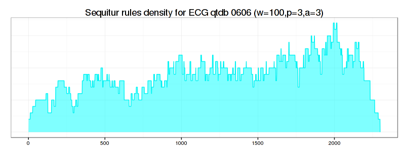
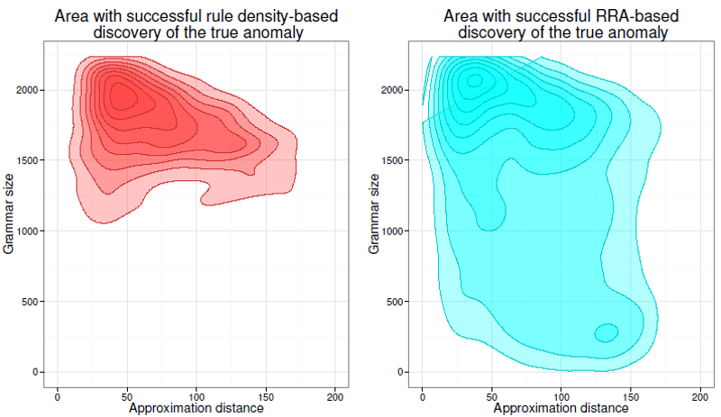
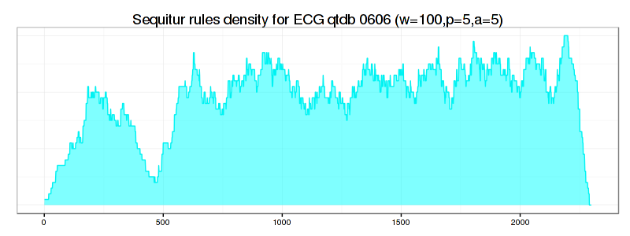
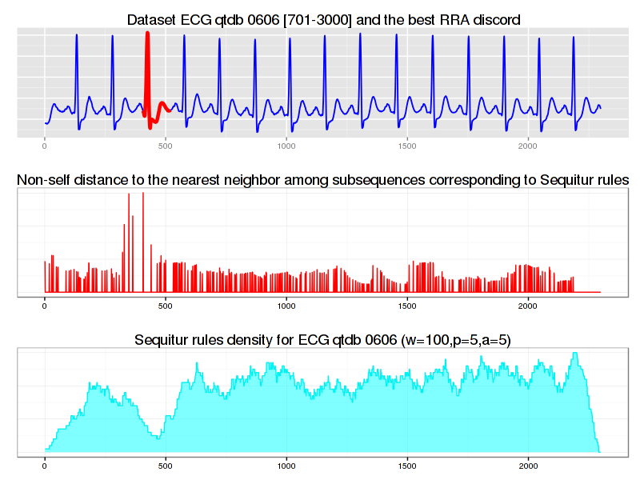

### Experiential Learning 2

## Anomaly discovery with GrammarViz 2.0 using command line interface

### 1. Introduction
In this module we discuss the anomaly detection in QTDB 0606 ECG dataset. This data set (database record) can be downloaded from [PHYSIONET FTP](http://physionet.org/physiobank/database/qtdb/) and converted into the text format by executing this command
<pre>
rdsamp -r sele0606 -f 120.000 -l 60.000 -p -c | sed -n '701,3000p' >0606.csv
</pre>
in the linux shell (assuming that you have rdsamp installed at your system).
We use the second column of this file. This is our dataset overview:

  

    

      
    

  

We know, that the third heartbeat of this dataset contains the true anomaly as it was discussed in [HOTSAX paper by Eamonn Keogh, Jessica Lin, and Ada Fu](http://www.cs.gmu.edu/~jessica/publications/discord_icdm05.pdf). Note, that the authors were specifically interested in finding anomalies which are shorter than a regular heartbeat following a suggestion given by the domain expert: "_... We conferred with cardiologist, Dr. Helga Van Herle M.D., who informed us that heart irregularities can sometimes manifest themselves at scales significantly shorter than a single heartbeat...._"
Figure 13 of the paper further explains the nature of this true anomaly:

  

    

      
    

  

## 2. Running GrammarViz 2.0 using CLI interface
Note, that by default, the GrammarViz 2.0 jar file is configured to launch GUI.
In contrast, in this tutorial, we will be using command line.
Here is an example of running GrammarViz 2.0 anomaly discovery module using CLI:

<pre>
$ java -cp "target/grammarviz2-0.0.1-SNAPSHOT-jar-with-dependencies.jar" net.seninp.grammarviz.GrammarVizAnomaly
14:13:01.977 [main] INFO  n.s.grammarviz.GrammarVizAnomaly - Parameters string: "[]"
GrammarViz2 v. 1.0 release, contact: seninp@gmail.com
Expected parameters: 
 [1] algorithm to use: 1 - brute force, 2 - HOT SAX, backed by a Trie
                       3 - RRA algorithm, 4 - HOT SAX backed by a Hash
     *** for algorithm 2, PAA size will be equal to Alphabet size due to the *trie* design
         use algorithm 4 so PAA and Alphabet sizes may differ
     *** for brute force only sliding window parameter is expected 
 [2] dataset input file; 
 [3] window size; 
 [4] paa size; 
 [5] alphabet size; 
 [6] discords number to report; 
 [7] indicate true/false for RRA algorithm auxiliary output; 
</pre>

As shown, the code prints a help output expecting a number of parameters to be specified. The expected parameters and their order are:

1. The algorithm switch.
2. The dataset name.
3. The first discretization parameter: sliding window size.
4. The second discretization parameter: PAA (piecewise aggregate approximation) size parameter.
5. The third discretization parameter: alphabet size.
6. The number of discords to report (each new discord discovery can be expensive!).
7. A semaphore configuring the output. 

### 2.1. Brute-force discord discovery
So, let's find discords in our dataset using the brute-force discord search
(*note, that brute-force technique doesn't need any discretization parameters, only a sliding window size, but placeholders need to be in CLI anyway.
I use **1** as a placeholder for PAA, and alphabet sizes.*):

<pre>
$ java -cp "target/grammarviz2-0.0.1-SNAPSHOT-jar-with-dependencies.jar" net.seninp.grammarviz.GrammarVizAnomaly 1 data/ecg0606_1.csv 100 1 1 3
16:05:35.026 [main] INFO  net.seninp.grammarviz.GrammarVizAnomaly - Parameters string: "[1, data/ecg0606_1.csv, 100, 1, 1, 3]"
16:05:35.029 [main] INFO  net.seninp.grammarviz.GrammarVizAnomaly - Parsing param string "[1, data/ecg0606_1.csv, 100, 1, 1, 3]"
16:05:35.090 [main] INFO  net.seninp.grammarviz.GrammarVizAnomaly - Starting discords search with settings: algorithm 1, data "data/ecg0606_1.csv", window 100, PAA 1, alphabet 1, reporting 3 discords.
16:05:35.090 [main] INFO  net.seninp.grammarviz.GrammarVizAnomaly - running brute force algorithm...
16:05:35.094 [main] DEBUG n.s.j.s.d.BruteForceDiscordImplementation - currently known discords: 0 out of 3
16:05:36.363 [main] DEBUG n.s.j.s.d.BruteForceDiscordImplementation - best discord found at 411, best distance: 1.5045846602966542, in 1s208ms distance calls: 4203050
16:05:36.364 [main] DEBUG n.s.j.s.d.BruteForceDiscordImplementation - position 411, NN distance 1.5045846602966542, elapsed time: 1s269ms, distance calls: 4203050
16:05:36.364 [main] DEBUG n.s.j.s.d.BruteForceDiscordImplementation - currently known discords: 1 out of 3
16:05:37.232 [main] DEBUG n.s.j.s.d.BruteForceDiscordImplementation - best discord found at 37, best distance: 0.4787744771810631, in 868ms distance calls: 3605050
16:05:37.233 [main] DEBUG n.s.j.s.d.BruteForceDiscordImplementation - position 37, NN distance 0.4787744771810631, elapsed time: 869ms, distance calls: 3605050
16:05:37.233 [main] DEBUG n.s.j.s.d.BruteForceDiscordImplementation - currently known discords: 2 out of 3
16:05:38.030 [main] DEBUG n.s.j.s.d.BruteForceDiscordImplementation - best discord found at 539, best distance: 0.44370598373247144, in 797ms distance calls: 3326000
16:05:38.031 [main] DEBUG n.s.j.s.d.BruteForceDiscordImplementation - position 539, NN distance 0.44370598373247144, elapsed time: 798ms, distance calls: 3326000
discord #0 "#0", at 411 distance to closest neighbor: 1.5045846602966542, info string: "position 411, NN distance 1.5045846602966542, elapsed time: 1s269ms, distance calls: 4203050"
discord #1 "#1", at 37 distance to closest neighbor: 0.4787744771810631, info string: "position 37, NN distance 0.4787744771810631, elapsed time: 869ms, distance calls: 3605050"
discord #2 "#2", at 539 distance to closest neighbor: 0.44370598373247144, info string: "position 539, NN distance 0.44370598373247144, elapsed time: 798ms, distance calls: 3326000"

3 discords found in 2s940ms
</pre>

about 1.2 seconds later the code reports the best discord at the position 411:

  

    

      
    

  

### 2.2. [HOT-SAX](http://www.cs.ucr.edu/~eamonn/discords/)-driven discords discovery.
Now let's use HOT-SAX algorithm to find discords:

<pre>
$ java -cp "target/grammarviz2-0.0.1-SNAPSHOT-jar-with-dependencies.jar" net.seninp.grammarviz.GrammarVizAnomaly 2 data/ecg0606_1.csv 100 3 3 3 
16:05:59.467 [main] INFO  net.seninp.grammarviz.GrammarVizAnomaly - Parameters string: "[2, data/ecg0606_1.csv, 100, 3, 3, 3]"
16:05:59.471 [main] INFO  net.seninp.grammarviz.GrammarVizAnomaly - Parsing param string "[2, data/ecg0606_1.csv, 100, 3, 3, 3]"
16:05:59.522 [main] INFO  net.seninp.grammarviz.GrammarVizAnomaly - Starting discords search with settings: algorithm 2, data "data/ecg0606_1.csv", window 100, PAA 3, alphabet 3, reporting 3 discords.
16:05:59.522 [main] INFO  net.seninp.grammarviz.GrammarVizAnomaly - running HOT SAX Trie-based algorithm...
16:05:59.592 [main] INFO  n.s.j.s.discord.HOTSAXImplementation - Trie built in : 4ms
discord #0 "aaa", at 411 distance to closest neighbor: 1.5045846602966542, info string: "position 411, NN distance 1.5045846602966542, elapsed time: 517ms, distance calls: 328271"
discord #1 "aaa", at 37 distance to closest neighbor: 0.4787744771810631, info string: "position 37, NN distance 0.4787744771810631, elapsed time: 1s133ms, distance calls: 1071973"
discord #2 "aaa", at 539 distance to closest neighbor: 0.44370598373247144, info string: "position 539, NN distance 0.44370598373247144, elapsed time: 1s261ms, distance calls: 1316045"

Discords found in 3s62ms

</pre>

in less than a second HOT-SAX finds exactly the same discords.

### 2.3. Rare Rule Anomaly (RRA) -driven discords discovery.
Now let's use our new technique:

<pre>
$ java -cp "target/grammarviz2-0.0.1-SNAPSHOT-jar-with-dependencies.jar" net.seninp.grammarviz.GrammarVizAnomaly 3 data/ecg0606_1.csv 100 3 3 3 
16:06:36.490 [main] INFO  net.seninp.grammarviz.GrammarVizAnomaly - Parameters string: "[3, data/ecg0606_1.csv, 100, 3, 3, 3]"
16:06:36.493 [main] INFO  net.seninp.grammarviz.GrammarVizAnomaly - Parsing param string "[3, data/ecg0606_1.csv, 100, 3, 3, 3]"
16:06:36.547 [main] INFO  net.seninp.grammarviz.GrammarVizAnomaly - Starting discords search with settings: algorithm 3, data "data/ecg0606_1.csv", window 100, PAA 3, alphabet 3, reporting 3 discords.
16:06:36.547 [main] INFO  net.seninp.grammarviz.GrammarVizAnomaly - running RRA algorithm...
16:06:36.610 [main] INFO  net.seninp.grammarviz.GrammarVizAnomaly - Whole timeseries covered by rule intervals ...
params: [3, data/ecg0606_1.csv, 100, 3, 3, 3]
discord #0 "pos,calls,len,rule 417 15175 110 8", at 417 distance to closest neighbor: 0.013448785622157254, info string: "position 417, length 110, NN distance 0.013448785622157254, elapsed time: 89ms, distance calls: 15175"
discord #1 "pos,calls,len,rule 2082 46805 111 32", at 2082 distance to closest neighbor: 0.004159294671527497, info string: "position 2082, length 111, NN distance 0.004159294671527497, elapsed time: 93ms, distance calls: 46805"
discord #2 "pos,calls,len,rule 1572 36628 109 28", at 1572 distance to closest neighbor: 0.004090035435808949, info string: "position 1572, length 109, NN distance 0.004090035435808949, elapsed time: 63ms, distance calls: 36628"

Discords found in 371ms

</pre>

in half time of that of HOT-SAX we find the same true best discord:

  

    

      
    

  

two next anomalies, however, are different from brute force and HOT-SAX runs.

## 3. Auxiliary files
If we add the seventh parameter to the CLI command:

<pre>
$ java -cp "target/grammarviz2-0.0.1-SNAPSHOT-jar-with-dependencies.jar" net.seninp.grammarviz.GrammarVizAnomaly 3 data/ecg0606_1.csv 100 3 3 3 true
</pre>

the code produces two files: `distances.txt` and `coverage.txt`.

### 3.1 `distances.txt`
This file consists of three columns:

1. The time series position.
2. The distance to closest non-self match.
3. The subsequence length.

Something like this:

<pre>
$ head distances.txt
0,0.4839679741470506,126.0
1,0.0,0.0
2,0.0,0.0
...
</pre>

By using this file we can visually inspect how the discovered by RRA discord is rated among other subsequences.
Here is the [R](http://cran.r-project.org/) code we use (note that you'd need the [ggplot2](http://ggplot2.org/) and Cairo libs installed too):

<pre>
data=read.csv(file="../data/ecg0606_1.csv",header=F,sep=",")
distances=read.csv(file="../distances.txt",header=F,sep=",")
df=data.frame(time=c(1:length(data$V1)),value=distances$V2,width=distances$V3)
(pd <- ggplot(df, aes(time, value)) + geom_line(color="red") + theme_bw() +
  ggtitle("Non-self distance to the nearest neighbor among subsequences corresponding to Sequitur rules") + 
  theme(plot.title = element_text(size = rel(1.5)), axis.title.x = element_blank(),axis.title.y=element_blank(),
        axis.ticks.y=element_blank(),axis.text.y=element_blank())
)
CairoPNG(file = "ecg0606_distances.png", width = 800, height = 200, pointsize = 12, bg = "white")
print(pd)
dev.off()
</pre>

and which produces the next figure:

  

    

      
    

  

### 3.2 `coverage.txt`
This file is a single column file that contains exactly the amount of lines as the input file and reflects the **rule density curve**.
Here is the way to visualize this curve using R:

<pre>
density=read.csv(file="../coverage.txt",header=F,sep=",")
density_df=data.frame(time=c(1:length(density$V1)),value=density$V1)
shade <- rbind(c(0,0), density_df, c(2229,0))
names(shade)<-c("x","y")
(pc <- ggplot(density_df, aes(x=time,y=value)) +
  geom_line(col="cyan2") + theme_bw() +
  geom_polygon(data = shade, aes(x, y), fill="cyan", alpha=0.5) +
  ggtitle("Sequitur rules density for (w=100,p=3,a=3)") + 
  theme(plot.title = element_text(size = rel(1.5)), axis.title.x = element_blank(),
        axis.title.y=element_blank(),axis.ticks.y=element_blank(),axis.text.y=element_blank()))
CairoPNG(file = "ecg0606_density1.png",
         width = 800, height = 200, pointsize = 12, bg = "white")
print(pc)
dev.off()
</pre>

  

    

      
    

  

As shown above, the rule-density curve does not identify the anomaly clearly.
This is a **typical density curve behavior** when the SAX approximation is loose -- consider the figure below which shows that the area where the successful
discovery of this true anomaly with Density Curve approach is twice as small as the area of RRA success:

  

    

      
    

  

If we increase values for PAA and Alphabet discretization coefficients from 3 to 5, the situation improves significantly -- not only the true anomaly
becomes clearly articulated by the drop in rule density curve, but **all** the RRA discords now coincide with those reported by brute force and HOT-SAX algorithms:

<pre>
$ java -cp "target/grammarviz2-0.0.1-SNAPSHOT-jar-with-dependencies.jar" net.seninp.grammarviz.GrammarVizAnomaly 3 data/ecg0606_1.csv 100 5 5 3 true
16:07:43.702 [main] INFO  net.seninp.grammarviz.GrammarVizAnomaly - Parameters string: "[3, data/ecg0606_1.csv, 100, 5, 5, 3, true]"
16:07:43.705 [main] INFO  net.seninp.grammarviz.GrammarVizAnomaly - Parsing param string "[3, data/ecg0606_1.csv, 100, 5, 5, 3, true]"
16:07:43.756 [main] INFO  net.seninp.grammarviz.GrammarVizAnomaly - Starting discords search with settings: algorithm 3, data "data/ecg0606_1.csv", window 100, PAA 5, alphabet 5, reporting 3 discords.
16:07:43.756 [main] INFO  net.seninp.grammarviz.GrammarVizAnomaly - running RRA algorithm...
16:07:43.881 [main] INFO  net.seninp.grammarviz.GrammarVizAnomaly - Whole timeseries covered by rule intervals ...
params: [3, data/ecg0606_1.csv, 100, 5, 5, 3, true]
discord #0 "pos,calls,len,rule 406 18145 114 25", at 406 distance to closest neighbor: 0.013228247590601405, info string: "position 406, length 114, NN distance 0.013228247590601405, elapsed time: 109ms, distance calls: 18145"
discord #1 "pos,calls,len,rule 34 80126 112 77", at 34 distance to closest neighbor: 0.004952943427593215, info string: "position 34, length 112, NN distance 0.004952943427593215, elapsed time: 135ms, distance calls: 80126"
discord #2 "pos,calls,len,rule 531 132622 102 28", at 531 distance to closest neighbor: 0.0043192923082177835, info string: "position 531, length 102, NN distance 0.0043192923082177835, elapsed time: 193ms, distance calls: 132622"

Discords found in 627ms
</pre>

  

    

      
    

  

## 4. Discussion.
We discussed two new ways to discover time series anomaly (i.e., discord) -- the Rare Rule Anomaly (RRA) algorithm and the rule density curve.
As shown, the RRA algorithm is faster than other discord discovery techniques, namely brute-force and HOT-SAX.
In addition, we have shown that the approximation degree is crucial for the optimal performance of RRA and rule density curve algorithms.

## 5. The R code to combine all three plots into a nice figure.

  

    

      
    

  

<pre>
# libs!
require(Cairo)
require(ggplot2)
require(grid)
require(gridExtra)
#
data=read.csv(file="../data/ecg0606_1.csv",header=F,sep=",")
plot(data$V1,t="l")
#
df=data.frame(time=c(1:length(data$V1)),value=data$V1)
(p <- ggplot(df, aes(time, value)) + geom_line(lwd=0.65,color="blue1") +
  ggtitle("Dataset ECG qtdb 0606 [701-3000] and the best RRA discord") + 
  theme(plot.title = element_text(size = rel(1.5)), axis.title.x = element_blank(),axis.title.y=element_blank(),
        axis.ticks.y=element_blank(),axis.text.y=element_blank())
)  
red_line=df[406:(406+114),]
p = p + geom_line(data=red_line,col="red", lwd=1.6)
CairoPNG(file = "ecg0606_RRA.png",
         width = 800, height = 200, pointsize = 12, bg = "white")
print(p)
dev.off()

#
data=read.csv(file="../data/ecg0606_1.csv",header=F,sep=",")
distances=read.csv(file="../distances.txt",header=F,sep=",")
df=data.frame(time=c(1:length(data$V1)),value=distances$V2,width=distances$V3)
pd <- ggplot(df, aes(time, value)) + geom_line(color="red") + theme_bw() +
  ggtitle("Non-self distance to the nearest neighbor among subsequences corresponding to Sequitur rules") + 
  theme(plot.title = element_text(size = rel(1.5)), axis.title.x = element_blank(),axis.title.y=element_blank(),
        axis.ticks.y=element_blank(),axis.text.y=element_blank())
pd  
CairoPNG(file = "ecg0606_distances.png",
         width = 800, height = 200, pointsize = 12, bg = "white")
print(pd)
dev.off()

#
density=read.csv(file="../coverage.txt",header=F,sep=",")
density_df=data.frame(time=c(1:length(density$V1)),value=density$V1)
shade <- rbind(c(0,0), density_df, c(2229,0))
names(shade)<-c("x","y")
(pc <- ggplot(density_df, aes(x=time,y=value)) +
  geom_line(col="cyan2") + theme_bw() +
  geom_polygon(data = shade, aes(x, y), fill="cyan", alpha=0.5) +
  ggtitle("Sequitur rules density for ECG qtdb 0606 (w=100,p=5,a=5)") + 
  theme(plot.title = element_text(size = rel(1.5)), axis.title.x = element_blank(),
        axis.title.y=element_blank(),axis.ticks.y=element_blank(),axis.text.y=element_blank()))
CairoPNG(file = "ecg0606_density2.png",
         width = 800, height = 300, pointsize = 12, bg = "white")
print(pc)
dev.off()
#
CairoPNG(file = "ecg0606_three_plots.png",
         width = 800, height = 600, pointsize = 12, bg = "white")
print(arrangeGrob(p,pd,pc,ncol=1))
dev.off()
</pre>
