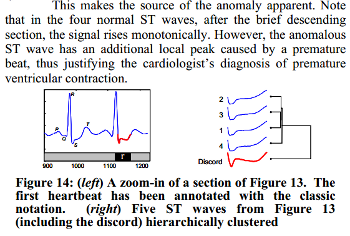

## Anomaly discovery with GrammarViz 2.0 using command line interface

### 1. Introduction
In this module we discuss the anomaly detection in QTDB 0606 ECG dataset. This data set (database record) can be downloaded from [PHYSIONET FTP](http://physionet.org/physiobank/database/qtdb/) and converted into the text format by executing this command
<pre>
rdsamp -r sele0606 -f 120.000 -l 60.000 -p -c | sed -n '701,3000p' >0606.csv
</pre>
in the linux shell (assuming that you have rdsamp installed at your system).
We use the second column of this file. This is our dataset overview:

  

    

      
    

  

We know, that the third heartbeat of this dataset contains the true anomaly as it was discussed in [HOTSAX paper by Eamonn Keogh, Jessica Lin, and Ada Fu](http://www.cs.gmu.edu/~jessica/publications/discord_icdm05.pdf). Note, that the authors were specifically interested in finding anomalies which are shorter than a regular heartbeat following a suggestion given by the domain expert: "_... We conferred with cardiologist, Dr. Helga Van Herle M.D., who informed us that heart irregularities can sometimes manifest themselves at scales significantly shorter than a single heartbeat...._"
Figure 13 of the paper further explains the nature of this true anomaly:

  

    

      
    

  

## 2. Running GrammarViz 2.0 using CLI interface
Note, that by default, the GrammarViz 2.0 jar file is configured to launch GUI.
In contrast, in this tutorial, we will be using command line.
Here is an example of running GrammarViz 2.0 anomaly discovery module using CLI:

<pre>
$ java -cp "target/grammarviz2-0.0.1-SNAPSHOT-jar-with-dependencies.jar" net.seninp.grammarviz.GrammarVizAnomaly
Usage: &lt;main class&gt; [options] 
  Options:
    --algorithm, -alg
       The algorithm to use
       Default: RRA
       Possible Values: [BRUTEFORCE, HOTSAX, RRA]
    --alphabet_size, -a
       SAX alphabet size
       Default: 4
    --data, -i
       The input file name
    --output, -o
       The output file prefix
       Default: &lt;empty string&gt;
    --discords_num, -n
       The algorithm to use
       Default: 5
    --gi, -g
       GI algorithm to use
       Default: Sequitur
       Possible Values: [Sequitur, Re-Pair]
    --strategy
       Numerosity reduction strategy
       Default: EXACT
       Possible Values: [NONE, EXACT, MINDIST]
    --threshold
       Normalization threshold
       Default: 0.01
    --window_size, -w
       Sliding window size
       Default: 170
    --word_size, -p
       PAA word size
       Default: 4
</pre>

As shown, the code prints a help output expecting a number of parameters to be specified. The expected parameters are:

 - The dataset name.
 - A discord discovery algorithm to use, depending on this choice, other parameters are required.
 - A number specifying how many discords to discover.
 - The output files prefix, if none is given, no files produced.
 - The GI algorithm switch.
 - The SAX transform parameters:
   - the sliding window size;
   - the PAA transform size;
   - the alphabet size;
   - the Z-normalization threshold value.

### 2.1. Brute-force discord discovery
Let's find discords in our dataset using the brute-force discord search:

<pre>
$ java -cp "target/grammarviz2-0.0.1-SNAPSHOT-jar-with-dependencies.jar" \
    net.seninp.grammarviz.GrammarVizAnomaly -alg BRUTEFORCE -i data/ecg0606_1.csv -w 100

GrammarViz2 CLI anomaly discovery
parameters:
 input file:                  data/ecg0606_1.csv
 output files prefix:         
 Algorithm implementation:    BRUTEFORCE
 Num. of discords to report:  5
 SAX sliding window size:     100

[main] INFO GrammarVizAnomaly - Reading data ...
[main] INFO GrammarVizAnomaly - read 2299 points from data/ecg0606_1.csv
[main] INFO GrammarVizAnomaly - running brute force algorithm...

discord #0 "#0", info string: "position 430, NN distance 5.252618285620532, elapsed time: 3s252ms, distance calls: 4403702"
discord #1 "#1", info string: "position 318, NN distance 4.154825115936453, elapsed time: 2s710ms, distance calls: 4004102"
discord #2 "#2", info string: "position 2080, NN distance 2.381003269560112, elapsed time: 2s487ms, distance calls: 3780326"
discord #3 "#3", info string: "position 25, NN distance 2.363633774221037, elapsed time: 2s106ms, distance calls: 3377405"
discord #4 "#4", info string: "position 1198, NN distance 2.0545797163895627, elapsed time: 2s131ms, distance calls: 3122605"

5 discords found in 12s689ms
</pre>

as shown, the best discord has been found at the position 430:

  

    

      
    

  

### 2.2. [HOT-SAX](http://www.cs.ucr.edu/~eamonn/discords/)-driven discords discovery.
Now let's use HOT-SAX algorithm to find discords:

<pre>
$ java -cp "target/grammarviz2-0.0.1-SNAPSHOT-jar-with-dependencies.jar" \
>     net.seninp.grammarviz.GrammarVizAnomaly -alg HOTSAX -i data/ecg0606_1.csv -w 100 -p 3 -a 3 --strategy NONE

GrammarViz2 CLI anomaly discovery
parameters:
 input file:                  data/ecg0606_1.csv
 output files prefix:         
 Algorithm implementation:    HOTSAX
 Num. of discords to report:  5
 SAX sliding window size:     100
 SAX PAA size:                3
 SAX alphabet size:           3
 SAX numerosity reduction:    NONE
 SAX normalization threshold: 0.01

[main] INFO GrammarVizAnomaly - Reading data ...
[main] INFO GrammarVizAnomaly - read 2299 points from data/ecg0606_1.csv
[main] INFO GrammarVizAnomaly - running HOT SAX hashtable-based algorithm...

discord #0 "acc", info string: "position 430, NN distance 5.252618285620532, elapsed time: 167ms, distance calls: 106249"
discord #1 "cab", info string: "position 318, NN distance 4.154825115936453, elapsed time: 161ms, distance calls: 118449"
discord #2 "caa", info string: "position 2080, NN distance 2.381003269560112, elapsed time: 190ms, distance calls: 126785"
discord #3 "cab", info string: "position 25, NN distance 2.363633774221037, elapsed time: 125ms, distance calls: 124504"
discord #4 "cab", info string: "position 1198, NN distance 2.0545797163895627, elapsed time: 114ms, distance calls: 138029"

5 discords found in 826ms
</pre>

since HOT-SAX is an exact algorithm, it finds exactly the same discords as the brute-force.

### 2.3. Rare Rule Anomaly (RRA) -driven discords discovery.
Now let's use our proposed algorithm:

<pre>
$ java -cp "target/grammarviz2-0.0.1-SNAPSHOT-jar-with-dependencies.jar" \
>     net.seninp.grammarviz.GrammarVizAnomaly -alg RRA -i data/ecg0606_1.csv -w 100 -p 3 -a 3

GrammarViz2 CLI anomaly discovery
parameters:
 input file:                  data/ecg0606_1.csv
 output files prefix:         
 Algorithm implementation:    RRA
 Num. of discords to report:  5
 SAX sliding window size:     100
 SAX PAA size:                3
 SAX alphabet size:           3
 SAX numerosity reduction:    EXACT
 SAX normalization threshold: 0.01
 GI Algorithm:                Sequitur

[main] INFO GrammarVizAnomaly - Reading data ...
[main] INFO GrammarVizAnomaly - read 2299 points from data/ecg0606_1.csv
[main] INFO GrammarVizAnomaly - running RRA algorithm...
[main] INFO GrammarVizAnomaly - 33 Sequitur rules inferred in 49ms
[main] INFO GrammarVizAnomaly - the whole timeseries is covered by rule intervals ...
[main] INFO RRAImplementation - 5 discords found in 92ms
discord #0, info string: "position 417, length 110, NN distance 0.11937994938399979, elapsed time: 42ms, distance calls: 1218"
discord #1, info string: "position 1809, length 208, NN distance 0.09251896613810194, elapsed time: 31ms, distance calls: 650"
discord #2, info string: "position 27, length 222, NN distance 0.09166713767633526, elapsed time: 6ms, distance calls: 420"
discord #3, info string: "position 1202, length 119, NN distance 0.08405901261690678, elapsed time: 6ms, distance calls: 1023"
discord #4, info string: "position 1474, length 230, NN distance 0.07513196795727577, elapsed time: 5ms, distance calls: 739"

5 discords found in 179ms
</pre>

significantly faster, RRA finds approximately the same best discord:

  

    

      
    

  

other discords, however, are different from brute force and HOT-SAX runs -- an issue which we address below...

## 3. Auxiliary files
If we add the seventh parameter to the CLI command:

<pre>
$ java -cp "target/grammarviz2-0.0.1-SNAPSHOT-jar-with-dependencies.jar" net.seninp.grammarviz.GrammarVizAnomaly 3 data/ecg0606_1.csv 100 3 3 3 true
</pre>

the code produces two files: `distances.txt` and `coverage.txt`.

### 3.1 `distances.txt`
This file consists of three columns:

1. The time series position.
2. The distance to closest non-self match.
3. The subsequence length.

Something like this:

<pre>
$ head distances.txt
0,0.4839679741470506,126.0
1,0.0,0.0
2,0.0,0.0
...
</pre>

By using this file we can visually inspect how the discovered by RRA discord is rated among other subsequences.
Here is the [R](http://cran.r-project.org/) code we use (note that you'd need the [ggplot2](http://ggplot2.org/) and Cairo libs installed too):

<pre>
data=read.csv(file="../data/ecg0606_1.csv",header=F,sep=",")
distances=read.csv(file="../distances.txt",header=F,sep=",")
df=data.frame(time=c(1:length(data$V1)),value=distances$V2,width=distances$V3)
(pd <- ggplot(df, aes(time, value)) + geom_line(color="red") + theme_bw() +
  ggtitle("Non-self distance to the nearest neighbor among subsequences corresponding to Sequitur rules") + 
  theme(plot.title = element_text(size = rel(1.5)), axis.title.x = element_blank(),axis.title.y=element_blank(),
        axis.ticks.y=element_blank(),axis.text.y=element_blank())
)
CairoPNG(file = "ecg0606_distances.png", width = 800, height = 200, pointsize = 12, bg = "white")
print(pd)
dev.off()
</pre>

and which produces the next figure:

  

    

      
    

  

### 3.2 `coverage.txt`
This file is a single column file that contains exactly the amount of lines as the input file and reflects the **rule density curve**.
Here is the way to visualize this curve using R:

<pre>
density=read.csv(file="../coverage.txt",header=F,sep=",")
density_df=data.frame(time=c(1:length(density$V1)),value=density$V1)
shade <- rbind(c(0,0), density_df, c(2229,0))
names(shade)<-c("x","y")
(pc <- ggplot(density_df, aes(x=time,y=value)) +
  geom_line(col="cyan2") + theme_bw() +
  geom_polygon(data = shade, aes(x, y), fill="cyan", alpha=0.5) +
  ggtitle("Sequitur rules density for (w=100,p=3,a=3)") + 
  theme(plot.title = element_text(size = rel(1.5)), axis.title.x = element_blank(),
        axis.title.y=element_blank(),axis.ticks.y=element_blank(),axis.text.y=element_blank()))
CairoPNG(file = "ecg0606_density1.png",
         width = 800, height = 200, pointsize = 12, bg = "white")
print(pc)
dev.off()
</pre>

  

    

      
    

  

As shown above, the rule-density curve does not identify the anomaly clearly.
This is a **typical density curve behavior** when the SAX approximation is loose -- consider the figure below which shows that the area where the successful
discovery of this true anomaly with Density Curve approach is twice as small as the area of RRA success:

  

    

      
    

  

If we increase values for PAA and Alphabet discretization coefficients from 3 to 5 and the numerosity reduction strategy to NONE, the situation improves significantly -- not only the true anomaly
becomes clearly articulated by the drop in rule density curve, but **most** of RRA discords now coincide with those reported by brute force and HOT-SAX algorithms:

<pre>
$ java -cp "target/grammarviz2-0.0.1-SNAPSHOT-jar-with-dependencies.jar" \
>     net.seninp.grammarviz.GrammarVizAnomaly -alg RRA -i data/ecg0606_1.csv -w 100 -p 5 -a 5 --strategy NONE

GrammarViz2 CLI anomaly discovery
parameters:
 input file:                  data/ecg0606_1.csv
 output files prefix:         
 Algorithm implementation:    RRA
 Num. of discords to report:  5
 SAX sliding window size:     100
 SAX PAA size:                5
 SAX alphabet size:           5
 SAX numerosity reduction:    NONE
 SAX normalization threshold: 0.01
 GI Algorithm:                Sequitur

[main] INFO GrammarVizAnomaly - Reading data ...
[main] INFO GrammarVizAnomaly - read 2299 points from data/ecg0606_1.csv
[main] INFO GrammarVizAnomaly - running RRA algorithm...
[main] INFO GrammarVizAnomaly - 257 Sequitur rules inferred in 78ms
[main] INFO GrammarVizAnomaly - the whole timeseries is covered by rule intervals ...
[main] INFO RRAImplementation - 5 discords found in 491ms
discord #0, info string: "position 430, length 101, NN distance 0.06231057192942393, elapsed time: 153ms, distance calls: 16187"
discord #1, info string: "position 317, length 101, NN distance 0.03874485695085472, elapsed time: 83ms, distance calls: 10815"
discord #2, info string: "position 24, length 101, NN distance 0.03203833783178889, elapsed time: 72ms, distance calls: 13597"
discord #3, info string: "position 2079, length 101, NN distance 0.025703333253996614, elapsed time: 78ms, distance calls: 12951"
discord #4, info string: "position 1194, length 101, NN distance 0.022876496057830178, elapsed time: 104ms, distance calls: 19266"

5 discords found in 610ms

</pre>

  

    

      
    

  

## 4. Discussion.
We discussed two new ways to discover time series anomaly (i.e., discord) -- the Rare Rule Anomaly (RRA) algorithm and the rule density curve.
As shown, the RRA algorithm is faster than other discord discovery techniques, namely brute-force and HOT-SAX.
In addition, we have shown that the approximation degree is crucial for the optimal performance of RRA and rule density curve algorithms.

## 5. The R code to combine all three plots into a nice figure.

  

    

      
    

  

<pre>
# libs!
require(Cairo)
require(ggplot2)
require(grid)
require(gridExtra)
#
data=read.csv(file="../data/ecg0606_1.csv",header=F,sep=",")
plot(data$V1,t="l")
#
df=data.frame(time=c(1:length(data$V1)),value=data$V1)
(p <- ggplot(df, aes(time, value)) + geom_line(lwd=0.65,color="blue1") +
  ggtitle("Dataset ECG qtdb 0606 [701-3000] and the best RRA discord") + 
  theme(plot.title = element_text(size = rel(1.5)), axis.title.x = element_blank(),axis.title.y=element_blank(),
        axis.ticks.y=element_blank(),axis.text.y=element_blank())
)  
red_line=df[406:(406+114),]
p = p + geom_line(data=red_line,col="red", lwd=1.6)
CairoPNG(file = "ecg0606_RRA.png",
         width = 800, height = 200, pointsize = 12, bg = "white")
print(p)
dev.off()

#
data=read.csv(file="../data/ecg0606_1.csv",header=F,sep=",")
distances=read.csv(file="../distances.txt",header=F,sep=",")
df=data.frame(time=c(1:length(data$V1)),value=distances$V2,width=distances$V3)
pd <- ggplot(df, aes(time, value)) + geom_line(color="red") + theme_bw() +
  ggtitle("Non-self distance to the nearest neighbor among subsequences corresponding to Sequitur rules") + 
  theme(plot.title = element_text(size = rel(1.5)), axis.title.x = element_blank(),axis.title.y=element_blank(),
        axis.ticks.y=element_blank(),axis.text.y=element_blank())
pd  
CairoPNG(file = "ecg0606_distances.png",
         width = 800, height = 200, pointsize = 12, bg = "white")
print(pd)
dev.off()

#
density=read.csv(file="../coverage.txt",header=F,sep=",")
density_df=data.frame(time=c(1:length(density$V1)),value=density$V1)
shade <- rbind(c(0,0), density_df, c(2229,0))
names(shade)<-c("x","y")
(pc <- ggplot(density_df, aes(x=time,y=value)) +
  geom_line(col="cyan2") + theme_bw() +
  geom_polygon(data = shade, aes(x, y), fill="cyan", alpha=0.5) +
  ggtitle("Sequitur rules density for ECG qtdb 0606 (w=100,p=5,a=5)") + 
  theme(plot.title = element_text(size = rel(1.5)), axis.title.x = element_blank(),
        axis.title.y=element_blank(),axis.ticks.y=element_blank(),axis.text.y=element_blank()))
CairoPNG(file = "ecg0606_density2.png",
         width = 800, height = 300, pointsize = 12, bg = "white")
print(pc)
dev.off()
#
CairoPNG(file = "ecg0606_three_plots.png",
         width = 800, height = 600, pointsize = 12, bg = "white")
print(arrangeGrob(p,pd,pc,ncol=1))
dev.off()
</pre>
