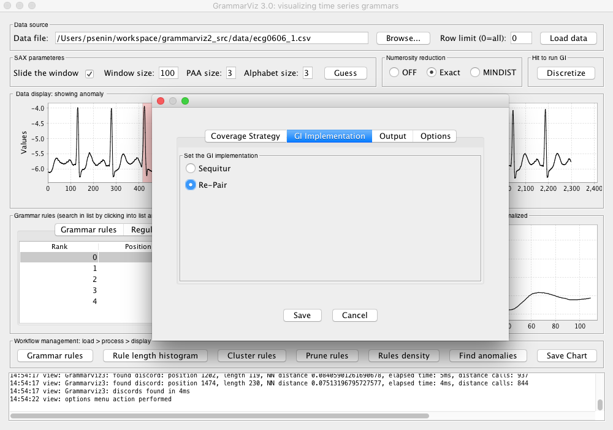

## Recurrent patterns discovery with GrammarViz 2.0 GUI

### 1. Introduction
We discuss two use-cases which show GrammarViz GUI utility in variable length time series pattern discovery.

### 2. Dataset used
Two datasets are used in this demo:

#### 2.1. Winding dataset
According to the [original dataset source](ftp://ftp.esat.kuleuven.ac.be/pub/SISTA/data/process_industry/winding.txt) this [dataset](https://jmotif.googlecode.com/svn/trunk/data/demo/winding.dat.gz) is a snapshot of data collected from industrial winding process whose column #2 corresponds to traction reel angular speed:

  

    

      
    

  

unfortunately, we do not know any specific information about this dataset.

#### 2.2. QTDB 0606 ECG dataset
This data set (database record) can be downloaded from [PHYSIONET FTP](http://physionet.org/physiobank/database/qtdb/) and converted into the text format by executing this command
<pre>
rdsamp -r sele0606 -f 120.000 -l 60.000 -p -c | sed -n '701,3000p' >0606.csv
</pre>
in the linux shell (assuming that you have rdsamp installed at your system).
We use the second column of this file. This is our dataset overview:

  

    

      
    

  

We know, that the third heartbeat of this ECG dataset contains the true anomaly as it was discussed in [HOTSAX paper by Eamonn Keogh, Jessica Lin, and Ada Fu](http://www.cs.gmu.edu/~jessica/publications/discord_icdm05.pdf). Note, that the authors were specifically interested in finding anomalies which are shorter than a regular heartbeat following a suggestion given by the domain expert: "_... We conferred with cardiologist, Dr. Helga Van Herle M.D., who informed us that heart irregularities can sometimes manifest themselves at scales significantly shorter than a single heartbeat...._"
Figure 13 of the paper further explains the nature of this true anomaly:

  

    

      
    

  

### 3. Time series discretization and grammar induction
There are two ways to perform time series discretization: global and overlapping sliding window-based (these are toggled by the checkbox "Slide the window"). We are using sliding window-based discretization in this demo.

The process of time series subsequence discretization is configured by three numerical parameters: sliding window size, PAA size, and the Alphabet size. These adjust discretization granularity, which typically affects the higher level algorithms sensitivity and selectivity, such as the ability to capture a local phenomenon. *Note however, that grammar induction step effectively mitigates improper sliding window selection.*

The grammar induction process requires no parameters.

### 4. Variable length recurrent patterns discovery
We use winding dataset in this example. Go "Browse"->select `winding.csv`->"Load data". GUI shows the plot of winding data. Now adjust discretization parameters: "Window size" 100, "PAA Size" 4, and "Alphabet size" 3. Push "Process data". At this point GUI displays grammar rules. Click on the "Mean length" column header, this sorts the table in ascending order, click again, this sorts the table in descending order. Click on the rule which has longest mean length, GUI shows that rule #29 has length ~353 and observed twice:

  

    

      
    

  

similarly, rules #21 and #33 are observed twice and have lengths of ~227 and ~187 respectively.

Now, click two times on the "Frequency in `R0`" column header and choose the most frequent rule which is #8:

  

    

      
    

  

the lengths of subsequences corresponding to this rule ranges from 102 to 121 and few of these subsequences overlap.

*Note that these variable-length subsequences correspond to single rule of the same grammar inferred by Sequitur from a discretized time series.*

Similarly, if we use `qtdb0606` dataset with SAX discretization parameters set to sliding window 100, PAA 8, and alphabet 4, the algorithm finds that the most frequently occurring rules are normal heartbeats:

  

    

      
    

  

## 5. Discussion
Note, that due to two factors: the numerosity reduction embedded in the data discretization process and the nature of GI algorithms, that create rules based on the long-range correlations, the shown above recurrent pattern discovery technique yields sets of frequent subsequences of a *variable length*.

<!-- Add a github ribbon. -->
<link rel="stylesheet" href="../../css/gh-fork-ribbon.css">

  

    <a href="https://github.com/GrammarViz2/grammarviz2_src">GrammarViz on GitHub</a>
  

