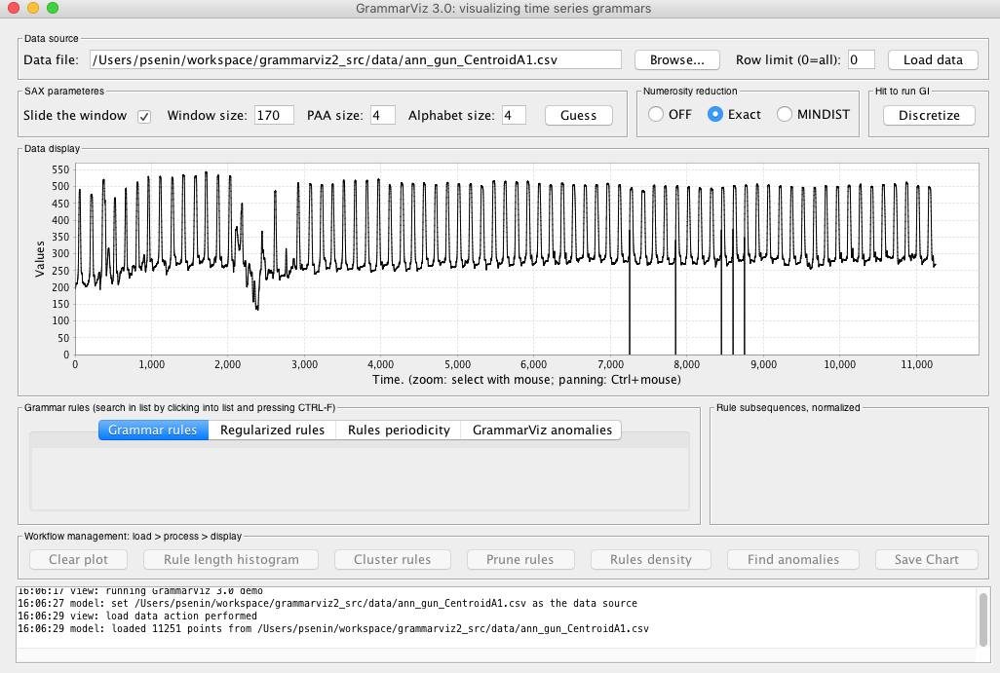
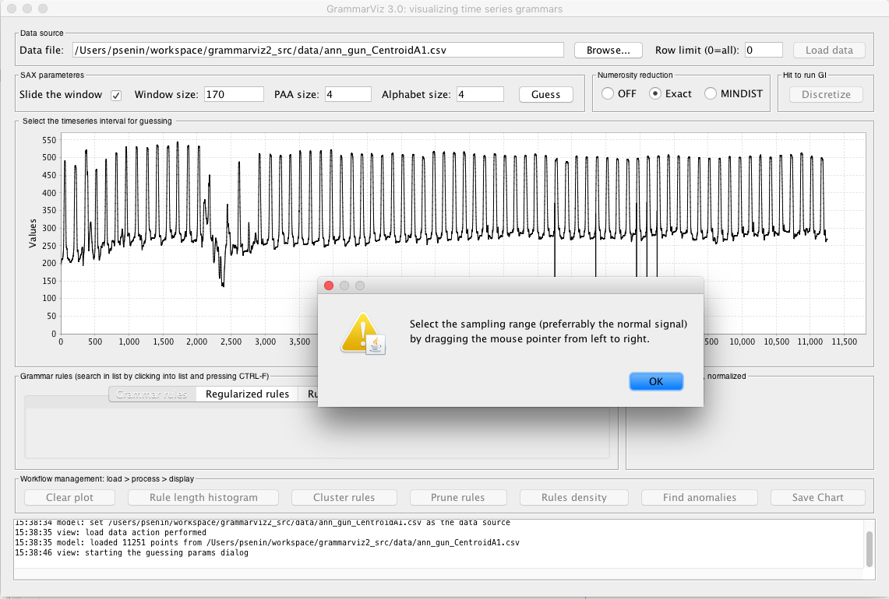
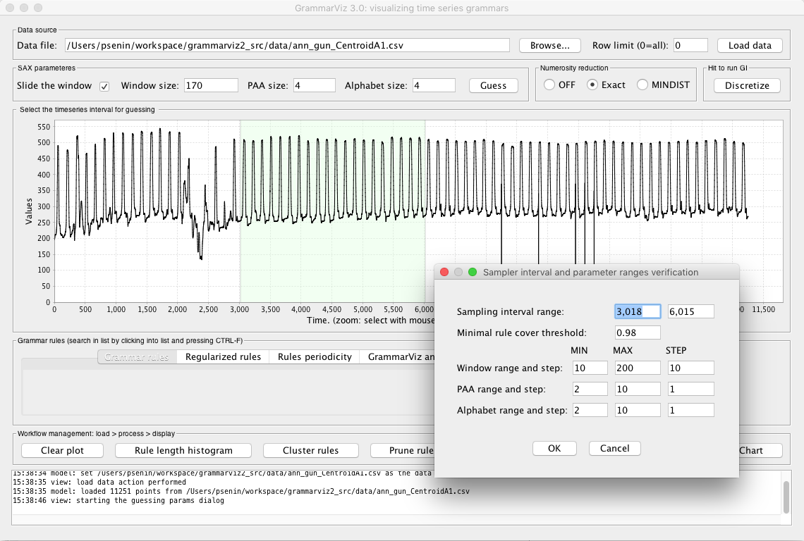
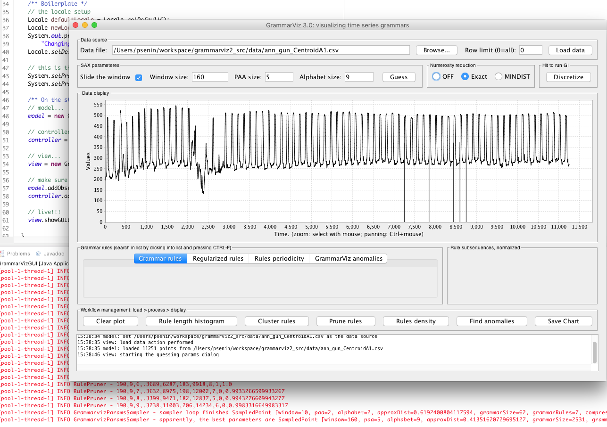
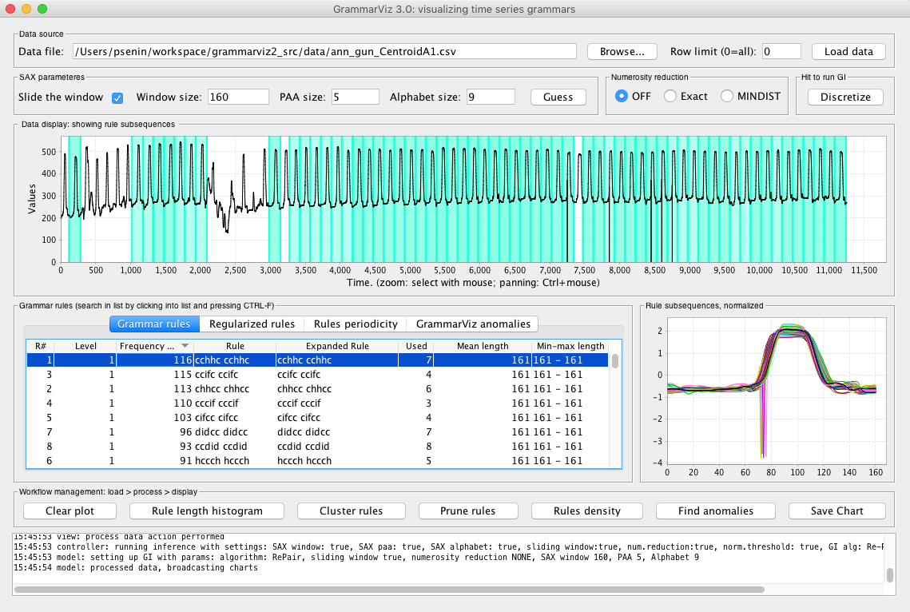
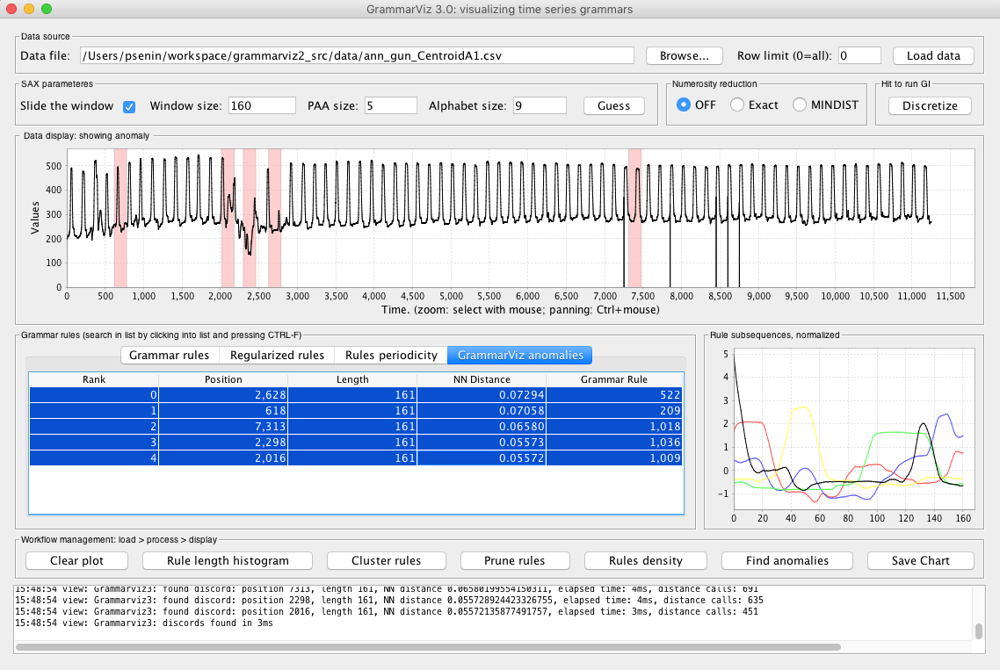

## Discretization parameters optimization with GrammarViz 3.0

### 1. Introduction

### 2. Example dataset

  

    

      
    

  

### 3. Sampling interval selection & Parameter sampling boundaries configuration

  

    

      
    

  

  

    

      
    

  

### 4. Sampling process

  

    

      
    

  

### 5. Using selected parameters -- numerous rules

  

    

      
    

  

### 6. Pruning the grammar, motif discovery

  

    

      
    

  

### 7. Pruning the grammar, RRA anomaly discovery

  

    

      
    

  

