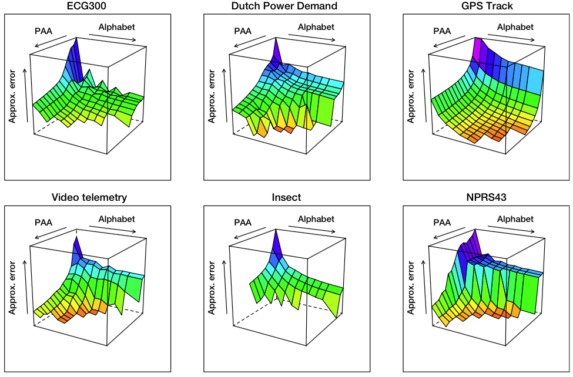
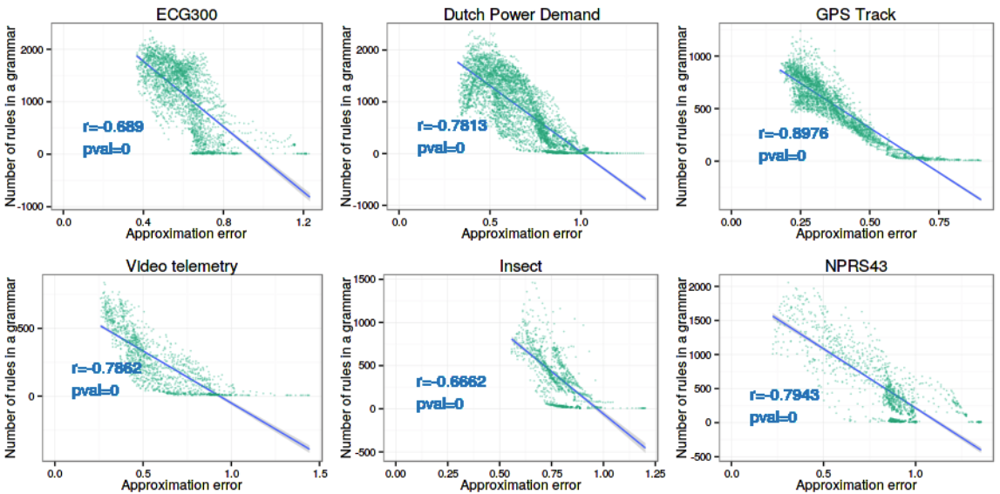
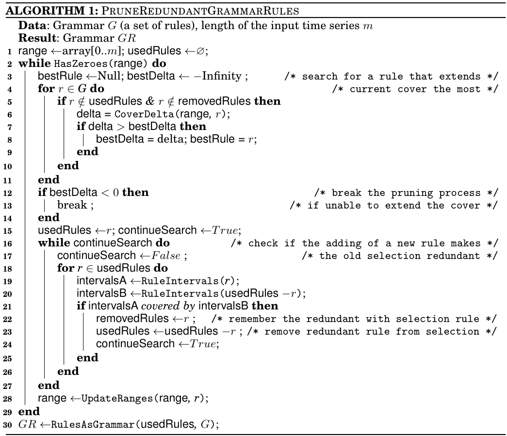
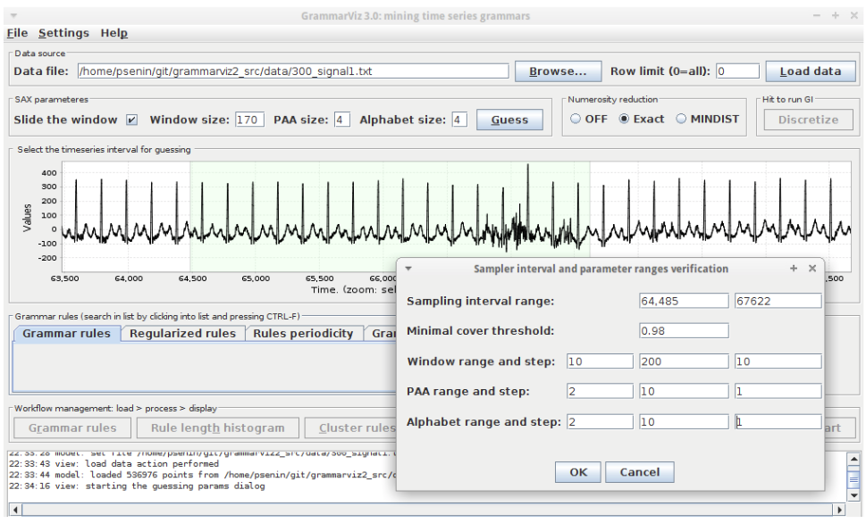

## GrammarViz 3.0 approach for SAX discretization parameters optimization.
In this module we describe the GrammarViz 3.0 approach for the automated discretization parameters selection.

### 1. SAX approximation error.
SAX approximation error can be seen as the sum of two error values computed for each of the subsequences extracted via a sliding window. These error values are (i) the PAA approximation error and (ii) the SAX transform approximation error, which are schematically shown below at the figure's right panels 

  

    

      
    

  

As shown, the PAA approximation error is the normalized sum of Euclidean distances between time series points after z-Normalization and their corresponding PAA values:

$$ \text{Error}_{\text{PAA}}(C_{p,p+n}) = 
\frac{
 \sum\limits_{i=p}^{i<p+n}\sqrt{(C_{i}-PAA_{C_{i}})^{2}}
}{n}
$$

where \\(C\\) is the subsequence of the time series T extracted via sliding window of length \\(n\\).

The SAX approximation error is the normalized sum of distances between the PAA values and the centers of SAX alphabet cut segments to which this values belong:

$$
\text{Error}_{\text{Alphabet}}(C_{PAA^{k}}) = 
\frac{
 \sum\limits_{i=0}^{i<k}\sqrt{(C_{PAA^{k}}^{i}-CutCenter(C_{PAA^{k}}^{i}))^{2}
 }
}{k}
$$

where \\(k\\) is the PAA size and \\(C\_{PAA^{k}}\\) is the PAA transform of \\(C\\). The value of the \\(CutCenter(C_{PAA^{k}}^{i})\\) is taken from the table of precomputed values similar to the SAX cut lines table. 

The intuition behind this error function design is that it accounts for an averaged distance between a time series point and its SAX representation over the whole time series. Naturally, as the values of PAA and Alphabet parameters of SAX transform increase, the approximation error decreases, as shown at the figure below where the surface-composing values are averaged for sliding windows ranging from 30 to 400.

  

    

      
    

  

At the same time, as the PAA and the Alphabet values increase, the amount of SAX words and their diversity also increase, causing the total number of rules in the resulting grammar to grow. Figure below indirectly shows that dependency by the strong negative correlation between the approximation error and the total number of rules in the grammar.

  

    

      
    

  

### 2. Grammar cover
In order to formally describe our redundant rule pruning technique and later the automated parameters selection procedure, we shall define the _Grammar Cover_ \\(Cover^{G}(T)\\) of a grammar \\(G\\) inferred from a time series \\(T\\) is the ratio of two values -- the number of time series points which are located within any of the subsequences corresponding to the grammar rules and the total length of time series, i.e.,

$$
\text{Grammar cover}_{G} = \frac{\text{number of time series points covered by any of the grammar rules} \in G}{\text{total number of points in the time series} T}
$$

### 3. Grammar rules numerosity and pruning.
The grammar-based time series decomposition offers an advantageous capability to find patterns of different lengths. However, the hierarchical and the variable-length natures of the patterns mean that often they are numerous and overlapping. While this specificity aids time series anomaly discovery via rule density curve, the large number of overlapping time series motif candidates is difficult to examine visually. Thus, the capacity of pruning and organizing rules in an intelligent way and a mechanism for their automated pruning are highly desirable. We approach the rule pruning with a greedy algorithm following a greedy solution of minimum-cardinality set cover problem (an NP-hard problem) which attempts to find the smallest set of rules which cover the most of the input time series in a greedy fashion. The algorithm is shown below:

  

    

      
    

  

As shown, the algorithm's input consists of a grammar \\(G\\) describing the input time series, and the time series length \\(m\\). The algorithm outputs a reduced grammar covering the same time series. The pruning process is wrapped into the outer loop (lines 2-29) which breaks in two cases: (i) when the whole time series span is covered by selected grammar rules or (ii) when it is impossible to extend the cover (lines 12-14). Two consecutive over-the-rules loops are inside the main outer loop. In the first loop (lines 4-11) the algorithm finds the rule which extends the current cover at most. In the second loop (lines 16-27) the algorithm performs a check on whether the addition of the new rule makes any of the previously selected rules obsolete -- in that case the redundant rule is removed from the selection and set aside. Upon finishing the pruning process, selected rules are partially expanded, following the exclusion of some of the initial rules (line 30), and the resulting grammar is returned.

### 4. The intuition behind the rule pruning algorithm.
The intuition behind this algorithm is simple -- since our task in hand is to find maximally repeated _and_ minimally-overlapping subsequences (which we consider the most informative), at each iteration, as the best candidate we select the rule which covers the most of the uncovered-so-far time series span thus naturally provides the most information about its structure. 

A notable property of our grammar pruning algorithm is that it searches for a minimal subset of grammar rules which _has the same cover as the full grammar_, which relates it to a series of algorithms dealing with serial episodes mining from event sequences (Tatti 2012), (Van 2014), (Lam 2014) which employ coding tables to find a minimal set of episodes for the observed sequence description in a succinct and characteristic manner. Also note, that these and our technique are built upon the similar foundation -- the Minimal Description Length (MDL) and Kolmogorov Complexity (i.e., algorithmic compression) formalisms.

### 5. The grammar reduction coefficient
Above, we proposed a grammar pruning procedure which is designed to eliminate redundant grammar rules that do not contribute to the time series grammar cover. We propose to use the ratio of rules in the pruned grammar to the total number of rules as the discriminative function for selecting the set of optimal discretization parameters:

$$
\text{ReductionCoefficient} = \frac{\text{number of rules in the pruned grammar}}{\text{number of rules in the full grammar}}
$$

### 6. Automated discretization parameters selection
The problem of discretization parameter optimization for time series anomaly and frequent pattern discovery remains unsolved to the best of our knowledge. In the GrammarViz 3.0, for the first time, we propose a semi-automated solution whose performance quality increases with the user participation. The proposed solution is based on the inherent discretization and grammar inference process properties which we shall discuss.

in order to select the optimal discretization parameters set for a time series under analysis, we propose the following process:

1. First, a parameter learning interval is chosen from the input time series. If the input time series is short, its whole span can be used; if it is long (tens of thousands of points), it is advisable to select a shorter interval to speed-up the sampling process. In addition to that, it is advisable to choose an anomaly- and noise-free interval which reflects the expected generative process in order to avoid learning biases.
2. Second, a range of acceptable discretization parameter values is specified. For example, for a sliding window length, the acceptable range can be from 10 to a doubled length of a typical structural phenomenon observed in the time series. For PAA, a typical range can be from 2 to 50 (assuming that the sliding window length is more than maximal PAA value); and for the alphabet from 2 to 15.
3. Third, for each of the parameter combinations within the specified ranges, a grammar is inferred and pruned, in order to compute the reduction coefficient value. However, during this sampling, any grammar whose cover falls below a fixed threshold -- usually in a range from 0.9 to 1.0 depending on the expectation for an anomalous ranges fraction -- shall be discarded as not describing the input time series in full and the corresponding parameters combination is marked as invalid.
4. Finally, among all sampled and valid combinations, we select the one which yields the minimal value of the reduction coefficient as the optimal discretization parameter set.

An explanation of our target function design and the parameter optimization process can be that the grammar reduction coefficient reflects a number of properties. First, it decreases when the denominator -- a number of rules in the grammar -- increases, which happens when the discretization parameters grow and _the approximation error decreases_ (shown above). This growth, however, is limited by the cover threshold, which makes sure that the correlations between words are occurring and it is possible to describe the time series by the grammar's hierarchical structure in full. Second, the grammar reduction coefficient also decreases when the numerator -- the number of the rules in the reduced grammar -- decreases, which happens when _the small number of non-redundant rules describes the time series in full_ (again, according to the desired cover threshold). Thus, by the design, the minimal grammar reduction coefficient value corresponds to a parameters set which allows to describe the input time series in full with the minimal approximation error, and which, at the same time, allows to reduce the grammar's hierarchical structure to only a few non-redundant rules.

We implemented the parameters optimization workflow in GrammarViz 3.0 as shown below. The typical interactive workflow scenario for the parameter optimization consists of few steps that can be repeated if necessary: loading the dataset into GrammarViz 3.0 GUI, exploring it using panning and zooming, selecting a dataset section which reflects the expected generative process, configuring the sampling grid density, and running the sampler.

  

    

      
    

  

